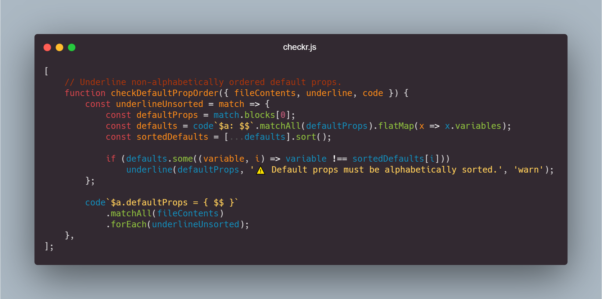

# checkr vs-code extension + git hook 🔍

**Write lint rules fast.**




## Installation

### Extension

Search for "checkr" in the VS Code extensions tab (Ctrl+Shift+X to open).

### Pre-commit hook

1. Follow the husky [installation instructions.](https://typicode.github.io/husky/#/?id=automatic-recommended)
2. Copy [`checkr-hook.js`](./checkr-hook.js) into the new `.husky` folder.
3. Add the line `node "$(dirname "$0")/checkr-hook.js"` to the bottom of the new `.husky/pre-commit` file.

That's it!

## Why

Linting is a powerful tool for enforcing project consistency and finding common issues. Many tools such as [ESLint](https://eslint.org/), [JSHint](https://jshint.com/), and others exist for this purpose. However, they do not have project specific rules, and writing a [custom eslint-rule](https://eslint.org/docs/developer-guide/working-with-rules) requires more setup and prior knowledge than a `checkr.js` file.

A checkr rule results in **less code review nits** and **catches bugs**.

## How

On file save and open, checkr looks for a `checkr.js` file in the current directory and iterates up to the root, applying any other `checkr.js` files along the way.

This means you can put global checks in the project root `checkr.js` file, but also have directory specific checks. For example `tests/checkr.js` only applies to files in the `tests` folder and its subdirectories.

A `checkr.js` file should contain a single array of functions to run on file save and open.

Each function is passed the `file` being saved or opened, a function to `underline` code, a function to find `code`, and a set of `utils`.

```typescript
interface params {
	fileName: string;       // Eg "fooUtil".
	fileExtension: string;  // Eg "js", "css", the empty string, etc.
	fileContents: string;   // Eg "console.log('In fooUtil.js file!')".
	filePath: string;       // Eg "C:\code\cool_project".
	
	underline: (
		regexOrText: RegExp | string, // Eg /foo*bar/g or an exact string to match, such as "foobar".
		hoverMessage: string,         // Eg "Prefer bar".
		alert?: "error" | "warn" | "info"
	) => void;
	
	code: (string: string, ...expressions: string[]) => RegExp;
	
	fs: NodeFileModule;                 // Eg fs.readFileSync('C:/foobar.txt');
	path: NodePathModule;               // Eg path.join('/foo', 'bar', 'baz/asdf', 'quux', '..');
	child_process: NodeProcessModule;   // Eg child_process.execSync('git status', { encoding: 'utf8' });
}
```

example `checkr.js` file layout

```javascript
[
	function check1({ fileContents, underline, code }) { ... },
	function check2({ fileContents, fileExtension, underline, fs }) { ... },
	function check3({ fileContents, fileName, underline, code }) { ... },
]
```

## `code` syntax
  
`code` translates a simple "code finding syntax" into a `RegExp` which can be used to `underline` things.  
**[Play around with `code` syntax here](https://www.itslit.fr/)**  
  
<br/>
⚠️ It is not as robust as an AST parser. Complex variable names with emojis and unicode are unsupported.

| Token      | Matches            | Query                               | Example Match                                                         |
| ---------- | ------------------ | ----------------------------------- | --------------------------------------------------------------------- |
| $a         | variable           | if ($a == $b) return { $a; }        | if (foo == bar) { return foo; }                                       |
| $1         | literal            | $1 + $2 + $1 + $2                   | 5 + "four" + 5 + "four"                                               |
| $@       | operator           | 5 \$@ops1 10 \$@ 15 $@ops1 33   | 5 \* 10 + 15 \* 33                                                    |
| $#      | keyword            | $# ($a == true)             | do (baz == true)                                                      |
| $$         | non-greedy any     | if ($a \$\$ $a) { \$\$ return 33; } | if (foo, bar, foo) { getFoo(); getBar(); return 33; }                 |
| $$$        | greedy any         | case $1: $$$ case $2: throw;        | case "Apples": return 1; case "Bananas": throw; case "Mangos": throw; |
| REGEX(...) | regex escape hatch | REGEX(3+9+2\*) 5 + 5                | 33922225+5                                                            |

```
Variable matchers: `$a`, `$Abcd`, `$foobar55`	✔️		`$`, `$44a`, `$^`	❌  
Literal matchers: `$1`, `$2`, `$333`		✔️		`$`, `$az1`, `$\`	❌  
Operator matchers: `$@`, `$@a`, `$@Operator22`	✔️		`$@@`, `$@2`, `$@%`	❌  
Keyword matchers: `$#`, `$#keyword`, `$#Key1`	✔️		`$#@`, `$#5`, `$##`	❌  
```

While `code` returns a `RegExp`, it also adds two methods to the returned object.  
`.matchAll(str)` returns all the captured results in an easy format, or an empty array for no matches.

```javascript
code`$#w ($a + $1) { return $$; }`.matchAll(`
	do(foo + "baz") {
		return getBar();
	}`);

// returns
[
	{
		blocks: ['getBar()'],
		keywords: ['do'],
		literals: ['"baz"'],
		operators: [],
		others: [],
		variables: ['foo'],
	},
];
```

`.matchFirst(str)` returns the first captured result.  
Note if there is nothing to capture **_or no matches_**, it will return an object with empty arrays.

```javascript
// Match, but no capture groups specified, eg $a, $1, $#k, etc.
code`foo = bar;`.matchFirst(`foo = bar;`);

// No match.
code`foo = bar;`.matchFirst(`nomatch`);

// both return
{
	blocks: [],
	keywords: [],
	literals: [],
	operators: [],
	others: [],
	variables: [],
}
```

## Examples

```javascript
[
	function requirePropDestructing({ fileContents, underline, code }) {
		const underlineComponents = match => {
			if (!match.blocks[2].includes('= props;'))
				underline(code`${match.variables[0]}($$ props $$)`, "❌ `props` must be destructed.", "error");
		}

		code`function $a($$ props $$) { $$$ }`
			.matchAll(fileContents)
			.forEach(underlineComponents);
	},

	function requireButtonTypeAttribute({ fileContents, underline, code }) {
		const underlineInvalidButtons = match => match
			.blocks
			.filter(x => !x.includes('type='))
			.forEach(x => underline(x, "⚠️ `type` should be on buttons.", "warn"));

		code`<button $$>`
			.matchAll(fileContents)
			.forEach(underlineInvalidButtons);
	},

	function enforceBooleanPropNaming({ fileContents, underline, code }) {
		const underlineInvalidBooleanNames = match => {
			const is = match.variables[0].startsWith("is");
			const has = match.variables[0].startsWith("has");
			const should = match.variables[0].startsWith("should");
			const isRecommended = is || has || should;
			const hoverMessage = "💬 Consider prefix with 'is', 'has', or 'should'.";
			if (!isRecommended)
				underline(code`${match.variables[0]}: PropTypes.bool$$`, hoverMessage, "info");
		};
		
		code`$a: PropTypes.bool$$`
			.matchAll(fileContents)
			.forEach(underlineInvalidBooleanNames)
	}
];
```

## Best Practices

- Verify an ESLint rule for the problem doesn't already exist.
- Prefer writing a custom ESLint rule for complicated checks.
- Avoid solving problems with linters that may be better handled with other methods.
- Prefer checks that are actionable and accurate over 90% of the time.

[More best practices here.](https://cacm.acm.org/magazines/2018/4/226371-lessons-from-building-static-analysis-tools-at-google/fulltext)  
[Test regex patterns here.](https://www.regextester.com)  
[Test regex patterns here.](https://www.regextester.com)  

## Contributing

All improvements are welcome. When opening a PR or updating the wiki feel free to add your name to the [contributors.md](contributors.md) and an emoji if you'd like, so your name can be immortalized until the end of time!

Feel free to take any ideas or invent your own:

- `import` support in `checkr.js` files.
- Adding useful checks to the `examples/` folder.
- More options to run at intervals or on other events.
- Optimizations such as file caching.

To debug the extension:

1.  `git clone` the repo.
1.  Install `yarn` and run in it the project root. See `package.json` for a full list of commands.
1.  Run `yarn watch` to compile the TypeScript into JavaScript and "watch" for any file changes.
1.  Open the project in VS code, and press `F5`.
1.  `Ctrl+R` in the debug window reloads the extension.

## Contact

cs@eriklanning.com
