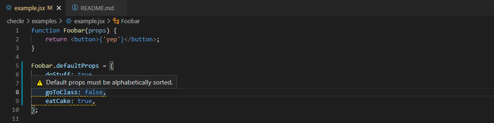

# checkr vs-code extension + git hook 🔍

Custom static analysis rules for the lazy. Write project specific static analysis checks in a few lines of code.



## Installation

### Extension

Search for "checkr" in the VS Code extensions tab (Ctrl+Shift+X to open).

### Pre-commit hook

1. Copy [checkr-hook.js](./checkr-hook.js) into the project's hook folder (typically `/hooks`).
2. Install [husky](https://github.com/typicode/husky) with `npm install husky --save-dev`
3. Setup `package.json` with

```
"scripts": {
  "hooks:pre-commit": "node ./hooks/checkr-hook.js",
},
"husky": {
  "pre-commit": "npm run hooks:pre-commit",
},
```

That's it!

## Why

Static analysis is a powerful tool for enforcing project consistency and finding common issues. Many tools such as [ESLint](https://eslint.org/), [JSHint](https://jshint.com/), and others exist for this purpose.

However, they frequently do not have project specific rules, and writing a [custom eslint-rule](https://eslint.org/docs/developer-guide/working-with-rules) for trivial checks requires more setup and prior knowledge than a `checkr.js` file.

checkr bridges the gap between full on powerful AST analysis versus simple regex checks.

A checkr rule can result in less code review nits and catch entire classes of bugs that code itself cannot.

## How

On file save and open, checkr looks for a `checkr.js` file in the current directory and iterates up to the root, applying any other `checkr.js` files along the way.

This means you can put global checks in the project root `checkr.js` file, but also have directory specific checks. For example `tests/checkr.js` only applies to files in the `tests` folder and its subdirectories.

A `checkr.js` file should contain a single array of functions to run on file save and open.

Each function is passed the `file` being saved or opened, and a function to `underline` code.

```javascript
file {
    fileName: string,       // Eg "fooUtil".
    fileExtension: string,  // Eg "js", "css", the empty string, etc.
    fileContents: string,   // Eg "console.log('In fooUtil.js file!')".
    filePath: string,       // Eg "C:\code\cool_project".
}

function underline(
    fileOrRegex: RegExp | string,   // Eg /foo*bar/g or an exact string to match, such as "foobar".
    hoverMessage: string,           // Eg "Prefer bar".
    alert?: "error" | "warning" | "info"
);
```

`checkr.js`

```javascript
[
    function check1(file, underline) { ... },
    function check2(file, underline) { ... },
    function check3(file, underline) { ... },
]
```

## Examples

These are simple examples, but more advanced patterns are possible. For example, building dynamic regex based on `fileContents`, only running on certain files using regex checks, and more.

```javascript
[
	function timeZoneCasing({ fileExtension }, underline) {
		if (fileExtension !== 'js') return;

		underline('timezone', 'Prefer timeZone casing', 'error');
	},

	function appendViewOnClasses({ fileExtension, fileContents }, underline) {
		if (fileExtension !== 'js') return;

		const invalidClassNames = /^export class.*(?<!View)$/g;
		underline(
			invalidClassNames,
			"exported class names in this directory must end with 'View'.",
			'warn',
		);
	},

	function checkLazyLoadImports({ fileExtension }, underline) {
		if (fileExtension !== 'jsx') return;

		const dangerousLazyLoadSet = /import\('.+'\).then\(set.+\)/g;
		const hoverMessage =
			"Import should likely be\n `import('...').then(({ component }) => setIntegration(component))`";
		underline(dangerousLazyLoadSet, hoverMessage, 'info');
	},
];
```

## Best Practices

- Verify an ESLint rule for the problem doesn't already exist.
- Prefer writing a custom ESLint rule for complicated checks.
- Avoid solving problems with static analysis that may be better caught with other methods.
- Prefer checks that are actionable and accurate over 90% of the time.

[More best practices here.](https://cacm.acm.org/magazines/2018/4/226371-lessons-from-building-static-analysis-tools-at-google/fulltext)  
[Test regex patterns here.](https://www.regextester.com)

## Contributing

All improvements are welcome. When opening a PR or updating the wiki feel free to add your name to the [contributors.md](contributors.md) and an emoji if you'd like, so your name can be immortalized until the end of time!

Feel free to take any ideas or invent your own:

- Advanced regex similar to [CCGrep](https://github.com/yuy-m/CCGrep).
- `import` support in `checkr.js` files.
- Adding useful checks to the `examples/` folder.
- More options to run at intervals or on other events.
- Optimizations such as file caching.
- Automatically fixing certain errors.

To debug the extension, `git clone` the repo, open it in VS code, and press `F5`. `Ctrl+R` in the debug window reloads the extension.

## Contact

cs@eriklanning.com
